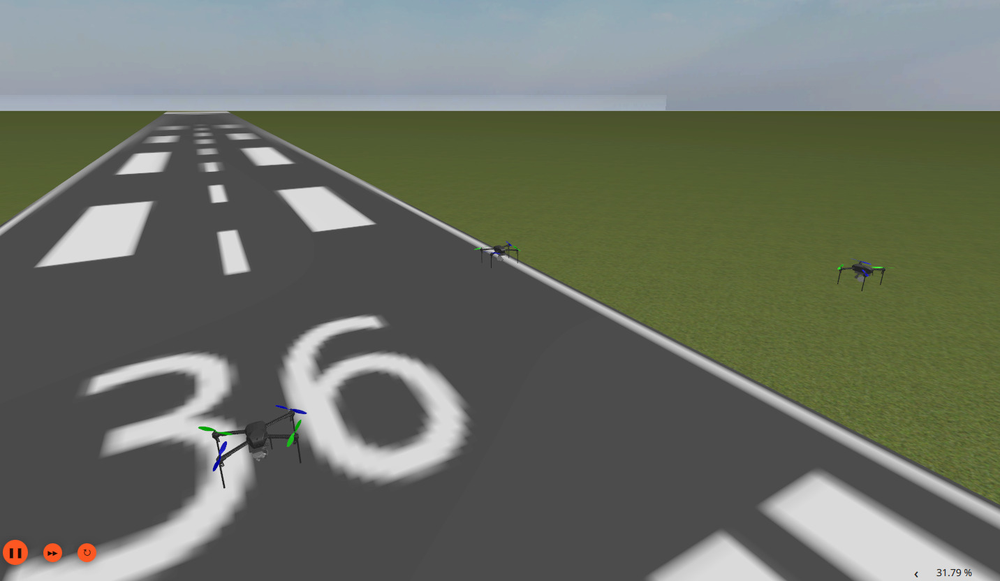

# p2-drone-formation-control-simulator

## Table of Contents 
- [Main Goal](#main-goal)
- [Prerequisites](#prerequisites)
- [Installation](#installation)
- [start simulation](#start-simulation)
- [Future work to do](#future-work-to-do)
- [Resources](#resources)
- [Documentation](#documentation)
- [License](#license)
- [Authors](#authors)
- [Misc](#misc)

## Main Goal 
- simulates quadcopter drones flying in formation
- drones follows path and maintain the formation
- path and formation can be changed

## Prerequisites 

- what do you expect the user of your repository to have before the installation process
- things like
  - what hardware do they need
  - do you need a specific OS / Distribution
  - do they have to install specific libraries
  - do they need to check or change system configurations

Before proceeding with the installation, ensure you have the following:  
- **Hardware Requirements:** None for the simulation   
- **Operating System:**  Ubuntu 22.04 , Use aif you use a virtual machine if you have windows  
- **Required Libraries:**  ROS2 jazzy jalisco , MAVROS, ArduPilot ,Gazebo 
  
## Installation

Install according to their documentation
- Ubuntu 24.04 
- ROS2 jazzy jalisco  
- gazeboo harmonic -> sudo apt install ros-jazzy-ros-gz 
- tkinter \
    -> rosdep did not find it, if not already installed do so
- ardupilot:
    1. change to the folder you want to install ardupilot 
    2. mkdir -p ardu_ws/src \
        -> need to be installed in own ros workspace 
    3. cd ardu_ws
    4. vcs import --recursive --input  https://raw.githubusercontent.com/ArduPilot/ardupilot/master/Tools/ros2/ros2.repos src \
        -> this downloads the repo
    4. "cd ardu_ws" \
        -> next steps need to be done in workspace folder
    5. "sudo apt update" 
    6. "rosdep update" \
        -> could be that you need to run "sudo rosdep init" first if rosdep is not initalized before
    7. "source /opt/ros/jazzy/setup.bash"
    8. "rosdep install --from-paths src --ignore-src -r -y"
    9. sudo apt install default-jre
    10. "git clone --recurse-submodules https://github.com/ardupilot/Micro-XRCE-DDS-Gen.git"
    11. "cd Micro-XRCE-DDS-Gen"
    12. "./gradlew assemble" \
        -> failed for me, needed to "sudo apt install openjdk-17-jdk" \
        -> "sudo update-alternatives --config java" \
        -> and switch to older java version 
    14. "echo "export PATH=\$PATH:$PWD/scripts" >> ~/.bashrc"
    15. "source ~/.bashrc"
    16. "cd .." \
        -> change back to workspace folder
    17. "colcon build --packages-up-to ardupilot_dds_tests" \
        -> fails because of error fastcdr version in cmake
           "https://github.com/micro-ROS/micro-ROS-Agent" \
        -> we removed the downloaded micro-ROS-AGENT folder 
           and downloaded the branch for jazzy directly from github
    18. "source ./install/setup.bash"
    19. "colcon test --executor sequential --parallel-workers 0 --base-paths src/ardupilot --event-handlers=console_cohesion+" \
        -> to show the result of the test use "colcon test-result --all --verbose" \
        -> next the steps to install necessary packages for gazebo+ros+ardu working together  
    20. "vcs import --input https://raw.githubusercontent.com/ArduPilot/ardupilot_gz/main/ros2_gz.repos --recursive src" \
        -> this downloads needed repos \
        -> it also downloads a second micro-ros-agent repo which you need to remove  \
        -> also ros_gz repo is for humble so it didn't compile for me \
        -> you can download the jazzy branch from "https://github.com/gazebosim/ros_gz/tree/jazzy" 
    21. add "export GZ_VERSION=harmonic" to ~/.bashrc
    22. "source /opt/ros/humble/setup.bash"
    23. "sudo apt update"
    24. "rosdep update"
    25. "rosdep install --from-paths src --ignore-src -r"    
    26. "colcon build" (in workspace directory) \
        -> I had a problem because I didn't had enough ram and swap space  \
        -> so if you have a crappy laptop like me (8GB RAM and 4GB swap) you should increase your swap space otherwise 
           your laptop freezes during building 
    27. "colcon test --packages-select ardupilot_sitl ardupilot_dds_tests ardupilot_gazebo ardupilot_gz_applications ardupilot_gz_description ardupilot_gz_gazebo ardupilot_gz_bringup" \
        -> test all packages, in this step I got the linter errors \
        -> "colcon test-result --all --verbose" gives the verbose test output
    28. "ros2 launch ardupilot_gz_bringup iris_runway.launch.py" \
        -> now this should be running and you should see a drone standing on a runway \
        -> so far no drone movement but you should see a  window for rviz and  one for gazebo  \
        -> there are more examples on the ardupilot docu site 

- found other package that not work correctly:
    - replace "sdformat_urdf" with jazzy branch "https://github.com/ros/sdformat_urdf/tree/jazzy" 
    - package "ardupilot_gz" also  

29. Install MAVROS with "sudo apt install ros-jazzy-mavros"
30.  Install Geographic lib
    -> ros2 run mavros install_geographiclib_datasets.sh

    # Alternative:
    wget https://raw.githubusercontent.com/mavlink/mavros/ros2/mavros/scripts/install_geographiclib_datasets.sh
    ./install_geographiclib_datasets.sh

31. Add these to your .bashrc to source the models created in the project for Gazebo
    export GZ_SIM_SYSTEM_PLUGIN_PATH=:/home/"your path to the project"/src/p2-drone-formation-control-simulator/models:
    export GZ_SIM_RESOURCE_PATH=:/home/"your path to the project"/src/p2-drone-formation-control-simulator/models:

## start simulation

- to prevent clutter I made a separate folder where we start the terminals mentioned in the steps below
- because both commands create additional files and a folder 
- to run a single drone simulation:
    1. open a terminal and launch "ros2 launch ardupilot_gz_bringup iris_runway.launch.py" \
        -> now gazebo and rviz should start
    2. open second terminal and run "mavproxy.py --master=udp:127.0.0.1:14550  --console --map --sitl=127.0.0.1:5501" \
        -> this will launch the mav proxy which acts as a ground station for the drone \
        -> maybe "--console" and "--map" not necessary because the additional windows are not really needed 
    3. to start the drone type in the terminal open in step 2. \
        -> "mode guided" \
        -> "arm throttle" \
        -> "takeoff 40" \
        -> now the drone should start the motors and take off to an altitude of 40m \
        -> you should see this in gazebo and rviz 
    4. you can give additional commands \
        -> see "https://ardupilot.org/mavproxy/docs/getting_started/cheatsheet.html" \
           and "https://ardupilot.org/dev/docs/copter-sitl-mavproxy-tutorial.html" \
           for further information
    5. "mode rtl" \
        -> drone return to home-waypoint, lands and stops the motors

- start simulation and command drone: 
    1. cmd from "ardupilot/Tools/ros2/README.md":
>>>
        ros2 launch ardupilot_sitl sitl_dds_udp.launch.py transport:=udp4 synthetic_clock:=True wipe:=False model:=quad speedup:=1 slave:=0 instance:=0 defaults:=$(ros2 pkg prefix ardupilot_sitl)/share/ardupilot_sitl/config/default_params/copter.parm,$(ros2 pkg prefix ardupilot_sitl)/share/ardupilot_sitl/config/default_params/dds_udp.parm sim_address:=127.0.0.1 master:=tcp:127.0.0.1:5760 sitl:=127.0.0.1:5501
>>>
    2. open additional terminal and type following cmd there:

    3. switch to guided mode

        ros2 service call /ap/mode_switch ardupilot_msgs/srv/ModeSwitch "{mode: 4}"

    4. arming motors

        ros2 service call /ap/arm_motors ardupilot_msgs/srv/ArmMotors "{arm: true}"

    5. takeoff with altitude of 20m

        ros2 service call /ap/experimental/takeoff  ardupilot_msgs/srv/Takeoff "{alt: 20.0}"

#### Shortened way to start sim : 

1. cd to ardu_ws directory 
2. `source ./install/setup.bash`
3. `colcon build --packages-select p2-drone-formation-control-simulator`
4. start the script : `. src/p2-drone-formation-control-simulator/launch/start_all.sh`
5. In another terminal 
   `ros2 launch p2-drone-formation-control-simulator gui.launch.py`

## Future work to do 

- if you know there are things you did not finish or cannot finish in the span of your project mention them here
- could also be a place for "known bugs" (could also be its own section)

- More and different formations
- Adding more complex path-planning
- Modify the movement to make it more accurate
- Different simulated environments

## Resources

(- if you have useful links, mention them here
- if you use other projects / libraries to build upon, mention them here
- if you get data sheets for your hardware, link them here )

- [ArduPilot Documentation](https://ardupilot.org/ardupilot/) – *ArduPilot Development Team* (Last updated: 17.03.2025)
- [ROS 2 Installation Guide](https://docs.ros.org/en/jazzy/Installation.html) – *Open Robotics* (Last updated: 2025)
- [ROS 2 Beginner CLI Tools Tutorial](https://docs.ros.org/en/jazzy/Tutorials/Beginner-CLI-Tools.html) – *Open Robotics* (Last updated: 2025)
- [Gazebo Tutorials](https://gazebosim.org/docs/latest/tutorials/) – *Open Source Robotics Foundation* (Last updated: 2025)
- [MAVROS Documentation](http://wiki.ros.org/mavros) – *Open Robotics* (Last updated: 03.03.2018)
- [Tkinter Documentation](https://docs.python.org/3/library/tkinter.html) – *Python Software Foundation* (Last updated: 18.03.2025)

## Documentation

- you can link to your report here
- you can also explain your arguments or parameters here, if applicable

## License 

- optional
- use MIT License

? 

## Authors

- Michael Faber : michael.faber@ovgu.de
- Christian Grüneberg: christian.grueneberg@ovgu.de
- Belvin Benny Thomas : belvin.benny@st.ovgu.de

## Misc

Some things that you should keep in mind

- READMEs are always written in Markdown, so you can use its capabilities
  - use [links](https://docs.gitlab.com/ee/user/markdown.html#links), [tables](https://docs.gitlab.com/ee/user/markdown.html#tables) etc. to your advantage
  - insert [images](https://docs.gitlab.com/ee/user/markdown.html#images) or [videos](https://docs.gitlab.com/ee/user/markdown.html#videos)
  - make your Readme a joy to read
- Another part of your documentation are your are your commits, so write [good commits](https://cbea.ms/git-commit/)
- the order of the paragraphs can be changed and you can of course add paragraphs and sections as you see fit

Keep your read me concise, if you have a lot of documentation, like a lot of parameters to explain then maybe it is a better idea to explain them in your config file directly and link to it. Or you can add a documentation folder to your project and link to Markdown files there. Another way would be to set up a wiki complementary to your code. Code documentation can also be done with tools like [Docxygen](https://www.doxygen.nl/).

Good luck with your project!
